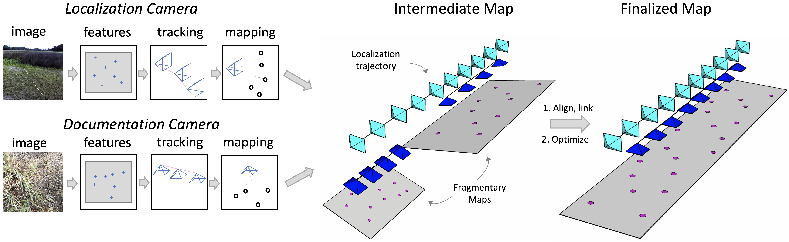
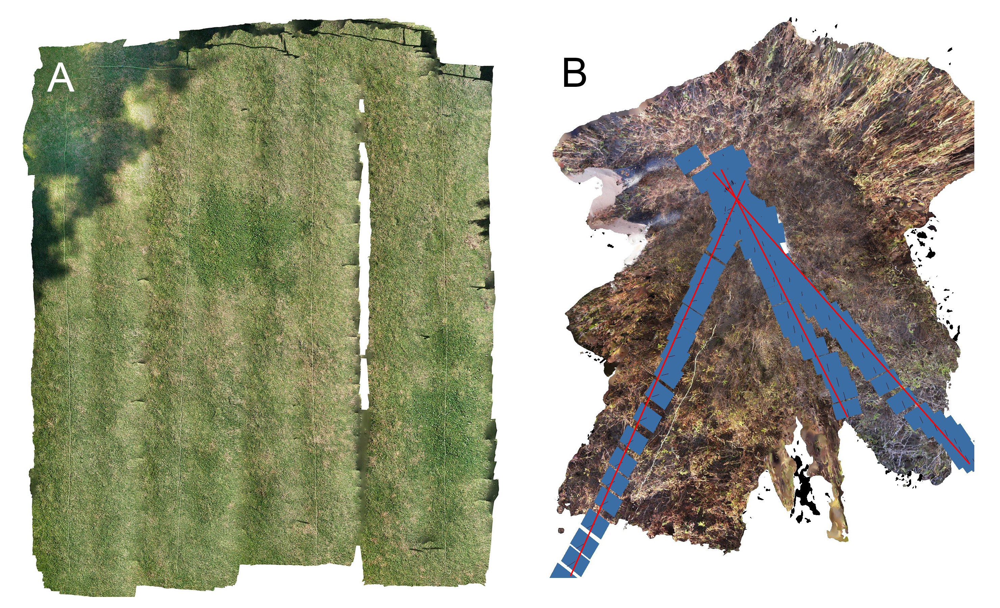

## HySLAM Overview
hySLAM is a hybrid SLAM/SfM system designed for mapping. 
The system is based on ORB-SLAM2 with some modification and refactoring.

Raúl Mur-Artal and Juan D. Tardós. **ORB-SLAM2: an Open-Source SLAM System for Monocular, Stereo and RGB-D Cameras**. *IEEE Transactions on Robotics,* vol. 33, no. 5, pp. 1255-1262, 2017.

ORB-SLAM2 original code: [ORB-SLAM2_repo](https://github.com/raulmur/ORB_SLAM2)

## Modifications:
1. Support for multiple cameras
2. Multi-map, recursive data structure: a recursive tree structure
   is used to handle sub-maps. Sub-maps can be optionally registered with their parent to
   make keyframes and map points accessible to the parent or
   the sub-map can be kept private
3. Trajectory tracking: Per-frame camera trajectories are explicitly recorded as SE(3) transformations relative to reference keyframes, whose positions are
   continuously updated via optimization 
4. Extensive code refactoring including converting tracking to a state-machine, conversion of mapping to a job based, parallel module, and addition of a separate feature extraction thread.

## Example Use
hySLAM was used as the basis for a dual-camera SLAM system to map visually repetitive ecosystems such as grasslands, where conventional Strucuture from Motion techniques are unreliable.
The dual-camera SLAM system uses a forward-facing stereocamera to provide localization information while a downward facing high-resolution "documentation" camera is used to record the ecosystem.
Conventional SLAM is used to analyze the forward-facing stereocamera video. The trajectory of the stereocamera is then used to guide localization and mapping from the documentation camera as illustrated in the figure below:

The dual-camera SLAM system allows reliable mapping of repetitive ecosystems as illustrated below:

A: Accurately reconstructed campus lawn
using dual camera SLAM. B: SfM failure due to visual aliasing (blue squares
represent aligned images). The three lines of images (highlighted in red)
should be parallel but instead converge on a single point in the reconstruction

## Dependencies:
1. pangolin
2. DBoW2
3. OpenCV

## Installation
1. in Thirdparty, compile and install g2o:
cmake ..
   make -jX
    sudo make install 
    sudo ldconfig
3. compile and install hyslam
in main CMakeLists set opencv directory
cmake ..
make -jX
sudo make install
4. build binary vocabulary: ./tools/bin_vocabulary
